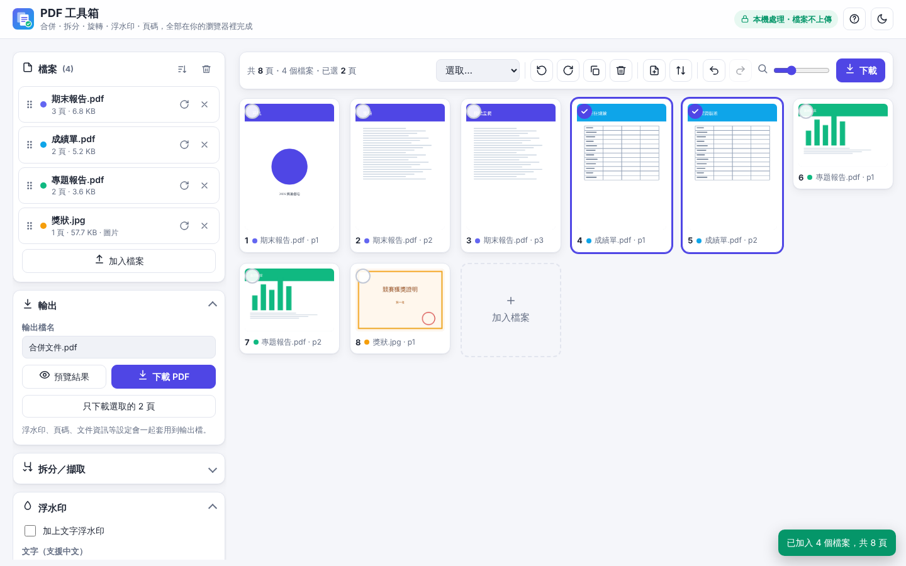

# PDF 工具箱

免安裝、免上傳的 PDF 合併與編輯網頁。所有處理都在你的瀏覽器裡完成，檔案不會被傳到任何伺服器。

🔗 **線上使用：** https://twl-benchen.github.io/pdf-edit/



## 功能

- **合併**：多個 PDF 和圖片（JPG／PNG／WebP／GIF）合成一個 PDF，也可以直接 Ctrl+V 貼上截圖
- **排序**：拖曳縮圖調整頁面順序（可多選一起拖、手機長按拖曳），或拖曳整份檔案
- **編輯頁面**：旋轉、複製、刪除、插入空白頁、反轉順序，全部可以復原／重做
- **拆分／擷取**：依頁碼範圍擷取，或每頁、每 N 頁、依原始檔案、自訂分組拆分成 ZIP
- **浮水印**：支援中文，可調大小、角度、顏色、透明度，置中或平鋪
- **頁碼**：6 種格式、6 種位置，可設定封面不編號
- **文件資訊**：標題、作者、主旨、關鍵字
- **影像化輸出**：壓縮掃描檔，或處理有權限限制的加密 PDF
- **雙面掃描合併**：把正面、背面兩個掃描檔交錯成正確順序
- 深色模式、手機版面、快速鍵、載入後可離線使用

## 為什麼做這個

線上 PDF 工具要把檔案上傳到別人的伺服器，而且常有大小或次數限制；現有的開源工具則要架伺服器或安裝軟體。這個工具只有一個 `index.html`，打開就能用，程式碼也能自己檢查。

詳細規格請見 [規格書.docx](規格書.docx)。

## 如何確認檔案沒有被上傳？

- 網頁只會從 cdnjs 下載 [pdf-lib](https://pdf-lib.js.org/) 與 [pdf.js](https://mozilla.github.io/pdf.js/) 兩個開源元件庫的程式碼。
- 頁面載入後關掉網路，一樣可以合併、下載。
- 按 F12 打開開發者工具的 Network 分頁，處理檔案時不會出現任何上傳請求。

## 檔案結構

```
index.html      全部的 HTML、CSS、JavaScript
assets/         網站圖示與介面截圖
```
